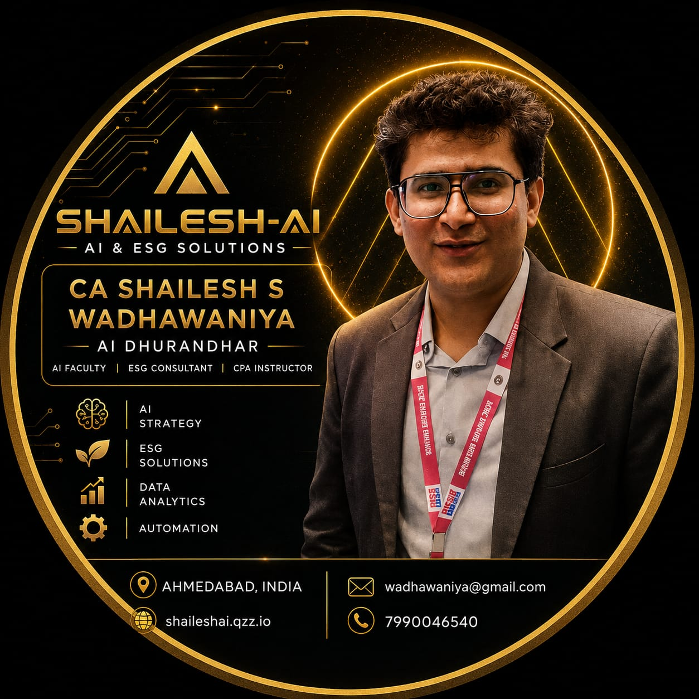

# CA Shailesh S. Wadhawaniya

**AI DHURANDHAR**

  

> “Transforming businesses through the power of Generative AI, Data Analytics, and Sustainable ESG strategies.”

**National AI Faculty (ICAI)** • **10k+ Professionals Trained** • Global ESG Leader • 10+ Years Practice

[shaileshai.qzz.io](https://shaileshai.qzz.io/) • [LinkedIn](https://www.linkedin.com/in/ca-shailesh-wadhawaniya)

---

## About Me

I empower modern finance professionals by bridging the gap between **Generative AI, Data Analytics, and Industry 4.0** technologies. With over **10,000+ Professionals & Business Leaders** trained in AI, I help enterprises automate operations and scale intelligently.

As an **ESG & Sustainability Leader**, I guide organizations on environmental responsibilities globally.

I am a **National Level Faculty** for ICAI, training professionals across India and for major enterprises like the Adani Group.

---

## What I Build & Teach

- **teach-me** — Your Personal AI Super Teacher. Turn any folder into a world-class private university using proven mastery methods (Feynman, retrieval practice, spaced repetition).
- Corporate Generative AI workshops and Train-the-Trainers programs for ICAI and enterprises.
- AI integration for audit, tax, compliance and ESG reporting.
- US CPA (REG & TCP) and Enrolled Agent (EA) education via StrideX.

---

## Core Competencies

**Generative AI & Technology**  
AI/ML Mastery • Data Analytics & Visualization • RPA • Big Data • Blockchain in Audit • Agent Systems & Skills Engineering

**ESG & Sustainability**  
BRSR Reporting • GRI, SASB & IIRC Frameworks • Social Audit • Net Zero Advisory • ESG Compliance Roadmap

**Professional Education**  
ICAI National Faculty (AICA Committee) • Train-the-Trainers • Corporate GenAI Workshops • 10k+ professionals trained

**Audit, Tax & Advisory**  
Statutory, Tax & Internal Audit • GST, Income Tax, FEMA, RERA • US Taxation (CPA/EA) • Forensic Accounting • Project Finance

---

## Professional Journey

**National AI Faculty & Corporate Trainer** (2022 – Present)  
ICAI & Major Enterprises (Pan-India)  
- Train-the-Trainers faculty  
- Trained 10,000+ professionals & business leaders  
- Generative AI use cases published on global platforms and ICAI AI Hub

**Principal AI & ESG Consultant** (2021 – Present)  
Wadhawaniya & Co., Ahmedabad  
- Embedding Industry 4.0 (Big Data, IoT, RPA, AI) into traditional audits  
- BRSR reporting and ESG advisory aligned with global frameworks  
- Full-service CA firm (GST, Income Tax, Statutory Audits, FEMA, RERA)

**Chief Educator** (2022 – Present)  
StrideX CPA(US) — Global  
Specialized coaching for US CPA REG & TCP and all three parts of the Enrolled Agent (EA) examination.

---

## Recognition

- National Level Faculty — ICAI AICA Committee (Certificate Course on AI for CAs)
- National Level Faculty — DITS & WTO Committee of ICAI
- Train-the-Trainers Faculty (AICA)
- Faculty for multiple ICAI Certificate Courses (Audit, Tax, AI, ESG)
- Certified Social Auditor (Institute of Social Auditor of India)
- FAFD (Forensic Accounting & Fraud Detection)
- AICA Level 1 & Level 2 Certified
- AIF in IFSCA GIFT City

---

## Thought Leadership & Publications

- AI Use Cases for Chartered Accountants (ICAI AI Hub)
- ESG Investing — New SEBI Regulations & Green Finance
- Indian Carbon Market — Policy Framework & Global Integration
- Research contributions to Social Stock Exchange / Social Audit frameworks (SRSB, ICAI)

---

## Connect

**Primary Website**: [shaileshai.qzz.io](https://shaileshai.qzz.io/)

- **LinkedIn**: [ca-shailesh-wadhawaniya](https://www.linkedin.com/in/ca-shailesh-wadhawaniya)
- **Email & Phone**: Available on website
- **Location**: Ahmedabad, Gujarat 380028, India

Open to serious collaborations on AI training, ESG advisory, corporate workshops, and professional mastery systems.

<i>Resilient. Resourceful. Dependable.</i>

  

